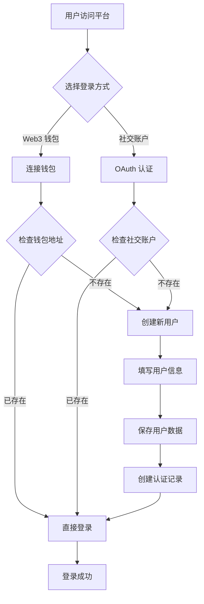
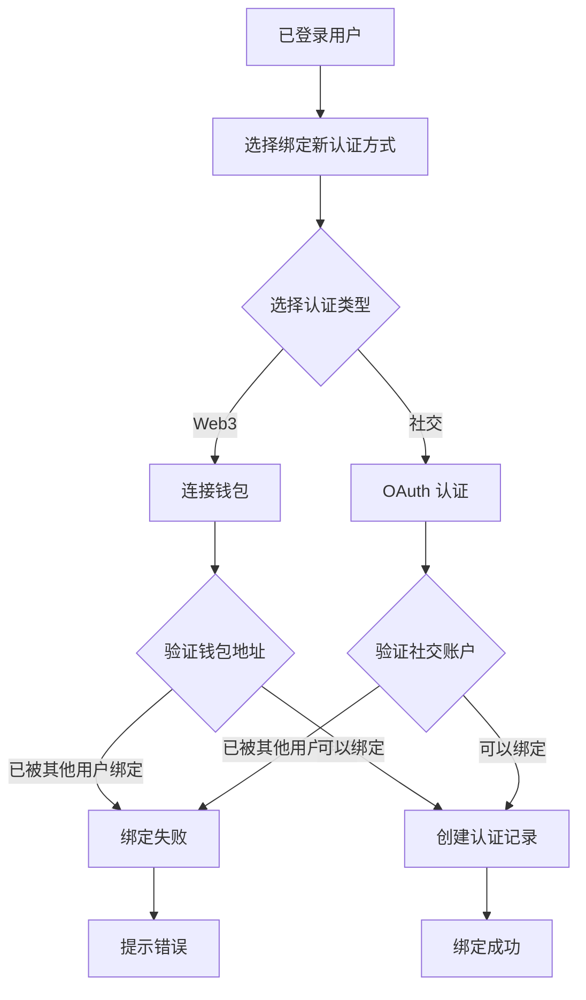

# MCPForge 用户系统设计文档

## 1. 项目概述

MCPForge 是一个支持多种认证方式的平台，用户可以通过 Web3 钱包或社交账户登录，并支持账户绑定功能。

## 2. 使用场景

### 2.1 登录方式
- **Web3 钱包登录**：用户可以通过 MetaMask 等 Web3 钱包登录
- **社交账户登录**：支持 Google、GitHub 等社交平台登录

### 2.2 账户绑定
- Web3 钱包用户可以在登录后绑定社交账户
- 社交账户用户可以在登录后绑定 Web3 钱包
- 一个用户可以绑定多种认证方式

### 2.3 用户角色
- **普通用户（user）**：使用平台的 AI 对话功能和 MCP Server 调用
- **开发者用户（developer）**：参与开源 MCP Server 开发，可领取平台基于收益的奖励

## 3. 系统架构设计

### 3.1 设计思路
- **用户表（Users）**：存储用户的基本信息和角色
- **登录方式表（AuthMethods）**：支持多种登录方式，实现账户绑定
- **开发者信息**：开发者需要额外的奖励地址信息

### 3.2 数据库设计

#### 3.2.1 用户表（Users）
存储用户的基本信息和角色。

| 字段名 | 类型 | 描述 | 约束 |
|--------|------|------|------|
| user_id | INT | 用户ID | 主键，自增 |
| username | VARCHAR(50) | 用户名 | 非空 |
| email | VARCHAR(100) | 邮箱 | 可选，社交登录提供 |
| role | ENUM | 用户角色 | 'user', 'developer'，默认 'user' |
| reward_address | VARCHAR(255) | 奖励接收地址 | 可选，开发者用户使用 |
| created_at | TIMESTAMP | 创建时间 | 默认当前时间 |
| updated_at | TIMESTAMP | 更新时间 | 自动更新 |

#### 3.2.2 登录方式表（AuthMethods）
存储用户的登录方式，支持多种类型并实现账户绑定。

| 字段名 | 类型 | 描述 | 约束 |
|--------|------|------|------|
| auth_id | INT | 登录方式ID | 主键，自增 |
| user_id | INT | 用户ID | 外键，关联 Users 表 |
| auth_type | ENUM | 登录类型 | 'web3', 'google', 'github' |
| auth_identifier | VARCHAR(255) | 登录标识 | 钱包地址或社交ID |
| created_at | TIMESTAMP | 创建时间 | 默认当前时间 |

**约束条件：**
- 外键约束：`user_id` 关联到 `Users.user_id`，级联删除
- 唯一约束：`(auth_type, auth_identifier)` 组合唯一

## 4. SQL 表结构实现

```sql
-- 用户表
CREATE TABLE Users (
    user_id INT AUTO_INCREMENT PRIMARY KEY,
    username VARCHAR(50) NOT NULL,
    email VARCHAR(100),
    role ENUM('user', 'developer') NOT NULL DEFAULT 'user',
    reward_address VARCHAR(255),
    created_at TIMESTAMP DEFAULT CURRENT_TIMESTAMP,
    updated_at TIMESTAMP DEFAULT CURRENT_TIMESTAMP ON UPDATE CURRENT_TIMESTAMP
);

-- 认证方式表
CREATE TABLE AuthMethods (
    auth_id INT AUTO_INCREMENT PRIMARY KEY,
    user_id INT NOT NULL,
    auth_type ENUM('web3', 'google', 'github') NOT NULL,
    auth_identifier VARCHAR(255) NOT NULL,
    created_at TIMESTAMP DEFAULT CURRENT_TIMESTAMP,
    FOREIGN KEY (user_id) REFERENCES Users(user_id) ON DELETE CASCADE,
    UNIQUE KEY unique_auth (auth_type, auth_identifier)
);
```

## 5. 业务流程设计

### 5.1 用户注册/登录流程



### 5.2 账户绑定流程



## 6. 使用场景示例

### 6.1 用户注册/登录
1. **Web3 钱包登录**：
   - 用户连接 MetaMask 钱包
   - 系统检查钱包地址是否已注册
   - 如未注册，创建新用户记录和认证记录
   - 如已注册，直接登录

2. **GitHub 登录**：
   - 用户通过 GitHub OAuth 认证
   - 系统获取 GitHub 用户信息
   - 检查是否已有对应的认证记录
   - 创建或登录用户

### 6.2 账户绑定
1. **绑定 Google 账户**：
   - 用户在个人设置中选择绑定 Google
   - 完成 Google OAuth 认证
   - 系统验证该 Google 账户未被其他用户绑定
   - 创建新的认证记录关联到当前用户

### 6.3 开发者奖励
1. **设置奖励地址**：
   - 开发者用户将角色设置为 'developer'
   - 填写 `reward_address` 字段
   - 平台根据 GitHub 认证记录关联开发者贡献
   - 自动计算并分配奖励到指定地址

## 7. 与云原生资源的关联

### 7.1 MCPServer 资源命名策略
在 MCPForge 平台上，我们定义了名为 MCPServer 的 CRD（自定义资源定义）。

**命名规则：**
- 格式：`{用户输入名称}-{user_id}-{随机数字}`
- 示例：`wiki-mcp-123-4567`

**资源标识：**
- **Annotation**: `mcpserver-name` 存储用户自定义显示名称
- **Label**: `user_id` 用于用户隔离

### 7.2 用户隔离机制
```yaml
apiVersion: mcpforge.io/v1
kind: MCPServer
metadata:
  name: wiki-mcp-123-4567
  annotations:
    mcpserver-name: "Wiki MCP"
  labels:
    user_id: "123"
spec:
  # MCPServer 配置
```

**查询示例：**
```bash
kubectl get mcpserver -l user_id=123
```

### 7.3 安全考虑
- **当前方案**：前端直接连接 K8s 集群，使用 Label 过滤
- **优化方案**：后端代理请求，添加用户权限验证

## 8. 实现状态

- ✅ 数据库表结构设计
- ✅ TypeORM 实体定义
- ✅ API 接口实现
- ✅ 数据库迁移
- ✅ 基础测试
- ✅ API 文档
- 🔄 认证中间件（待实现）
- 🔄 前端集成（待实现）
- 🔄 权限控制（待实现）

## 9. 扩展性考虑

### 9.1 支持更多认证方式
系统设计支持轻松添加新的认证类型：
```typescript
export enum AuthType {
  WEB3 = 'web3',
  GOOGLE = 'google',
  GITHUB = 'github',
  TWITTER = 'twitter', // 未来扩展
  FACEBOOK = 'facebook', // 未来扩展
}
```

### 9.2 用户权限扩展
可以扩展用户角色系统：
```typescript
export enum UserRole {
  USER = 'user',
  DEVELOPER = 'developer',
  ADMIN = 'admin', // 未来扩展
  MODERATOR = 'moderator', // 未来扩展
}
```
